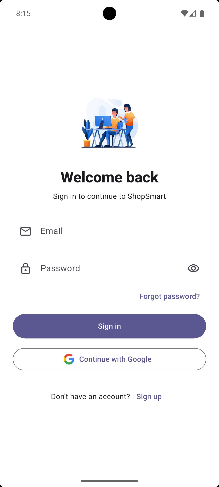
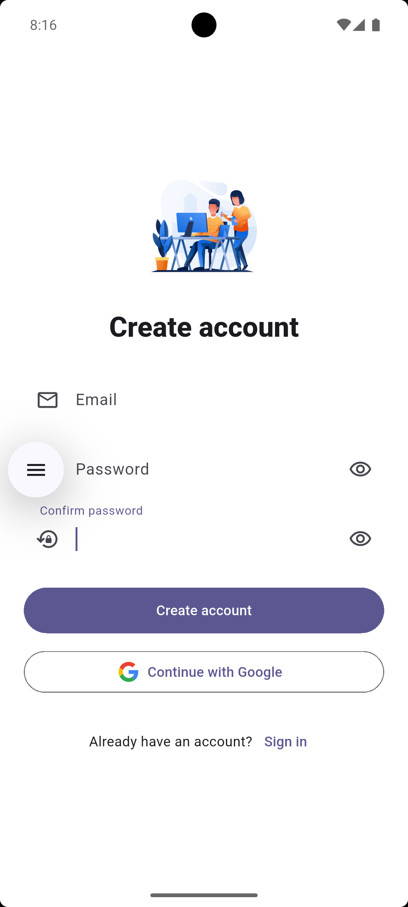
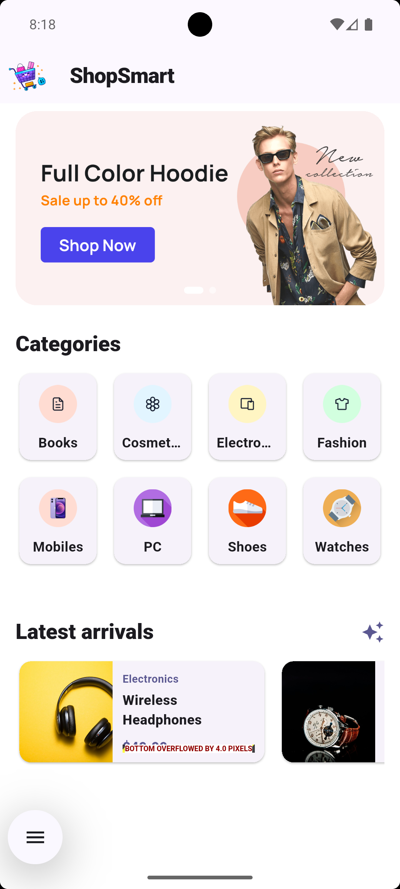
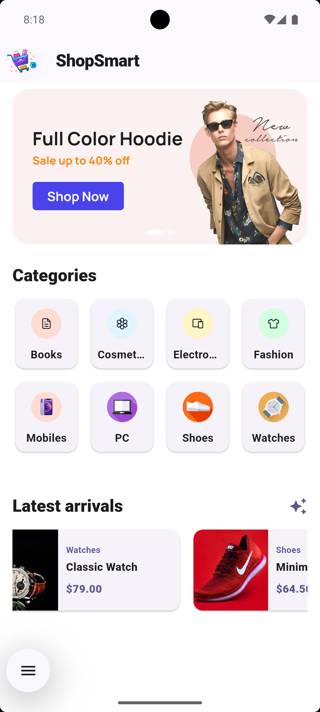
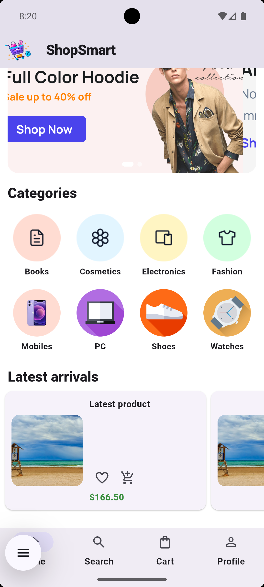
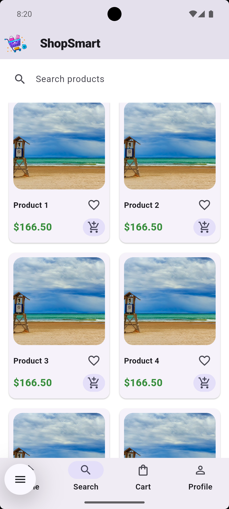
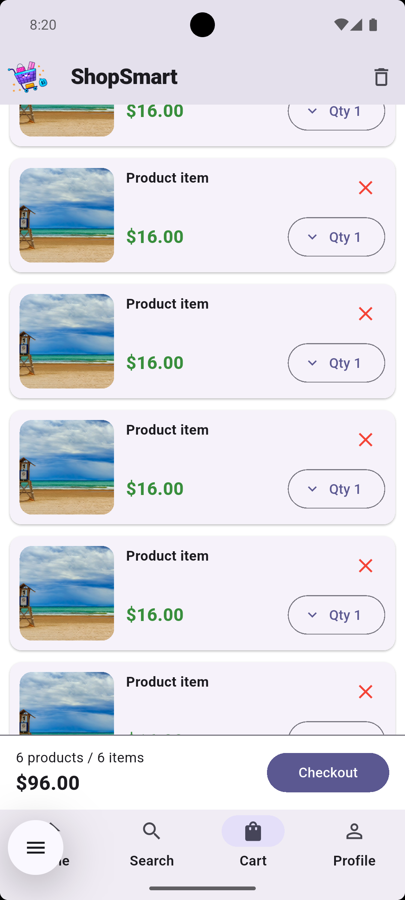
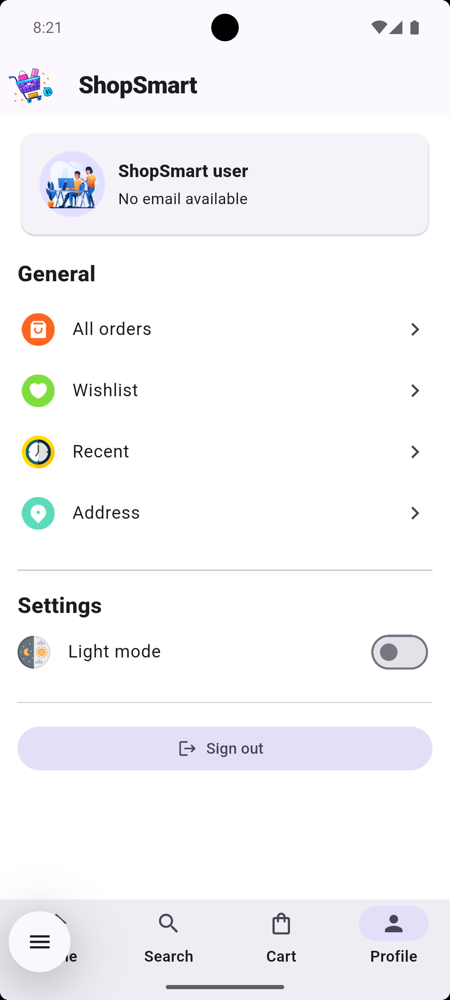
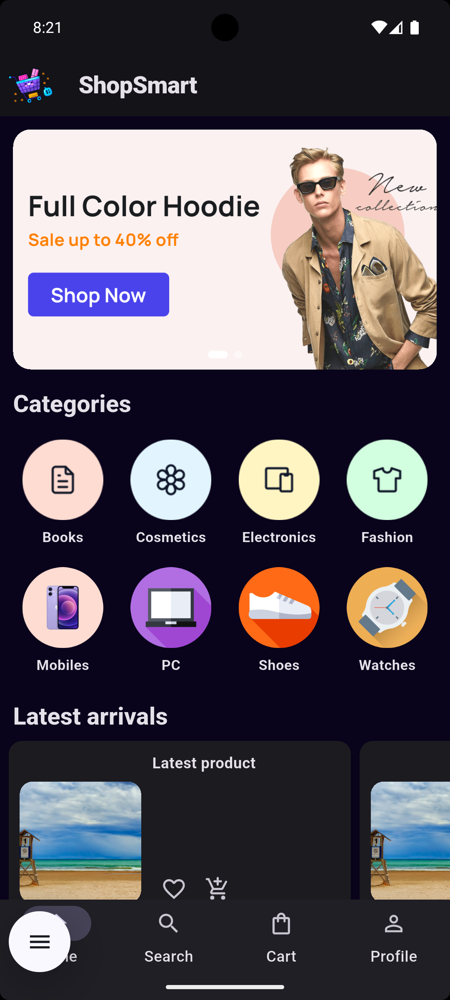

# 🛍️ ShopSmart

A modern Flutter shopping application focused on providing a clean, simple, and responsive shopping experience.

ShopSmart provides product browsing, categories, search, cart management, user authentication, wishlist management, recent items, profile settings, and light/dark mode support.

The application uses Firebase services for authentication and cloud-based product data.

---

## ✨ Features

* 🔐 Email & password authentication
* 🔑 Google Sign-In
* ☁️ Firebase Authentication
* ☁️ Cloud Firestore integration
* 🛍️ Product browsing
* 🗂️ Product categories
* 🔎 Product search
* 🛒 Shopping cart
* ❤️ Wishlist
* 🕘 Recently viewed products
* 📦 Orders and order history
* 📍 Address management
* 🌙 Light & dark mode
* 📱 Modern Material-based UI
* ⚡ Cached network images
* 🎨 Clean and responsive user experience

---

## 📸 Screenshots

### 🔐 Authentication

<div align="center">

<table>
<tr>
<td align="center">

<br/>
<b>Login</b>
</td>

<td align="center">

<br/>
<b>Create Account</b>
</td>
</tr>
</table>

</div>

---

### 🏠 Home & Products

<div align="center">

<table>
<tr>

<td align="center">

<br/>
<b>Home</b>
</td>

<td align="center">

<br/>
<b>Categories</b>
</td>

<td align="center">

<br/>
<b>Latest Products</b>
</td>

</tr>
</table>

</div>

---

### 🔎 Search & 🛒 Shopping

<div align="center">

<table>
<tr>

<td align="center">

<br/>
<b>Search</b>
</td>

<td align="center">

<br/>
<b>Shopping Cart</b>
</td>

<td align="center">

<br/>
<b>Profile</b>
</td>

</tr>
</table>

</div>

---

### 🌙 Dark Mode

<div align="center">



<br/>

<b>Dark Mode</b>

</div>

---

## 🛠️ Built With

* [Flutter](https://flutter.dev/)
* [Dart](https://dart.dev/)
* Firebase Authentication
* Cloud Firestore
* Google Sign-In
* Provider
* Shared Preferences
* Cached Network Image
* Material Design

---

## 📦 Main Dependencies

The project uses packages including:

```yaml
firebase_core
firebase_auth
cloud_firestore
google_sign_in
provider
shared_preferences
cached_network_image
```

See `pubspec.yaml` for the complete dependency configuration.

---

## 📁 Project Structure

```text
lib/
├── auth/
│   ├── auth.dart
│   ├── auth_service.dart
│   ├── google sign in.dart
│   ├── login.dart
│   └── signup.dart
│
├── cart/
│   ├── cart_screen.dart
│   ├── cart_widget.dart
│   ├── qty_button.dart
│   └── button_checkout.dart
│
├── consts/
├── General/
├── imgservices/
├── model/
├── products/
├── provider/
├── screen/
├── widget/
│
├── firebase_options.dart
├── main.dart
└── rootscreen.dart

assets/
└── img/

screenshots/
├── login-screen.png
├── create-account-screen.png
├── home-screen.png
├── categories-screen.png
├── latest-products-screen.png
├── search-screen.png
├── shopping-cart-screen.png
├── profile-screen.png
└── dark-mode-screen.png
```

---

## 🚀 Getting Started

### Prerequisites

Make sure Flutter and Dart are installed.

Check your Flutter installation:

```bash
flutter doctor
```

### Clone the Repository

```bash
git clone https://github.com/YOUR_USERNAME/shopsmart.git
```

Navigate to the project directory:

```bash
cd shopsmart
```

Install dependencies:

```bash
flutter pub get
```

Run the application:

```bash
flutter run
```

---

## 🔥 Firebase Configuration

ShopSmart uses Firebase Authentication and Cloud Firestore.

Before running the application, configure Firebase for the target platform.

The project includes:

```text
lib/firebase_options.dart
```

Additional platform-specific Firebase configuration files may be required depending on the target platform and project setup.

---

## 🔑 Authentication

ShopSmart supports:

* Email and password sign-in
* Account registration
* Password recovery
* Email verification
* Google authentication

---

## 🛒 Shopping Experience

The application provides a basic shopping flow:

```text
Browse Categories
       ↓
Browse Products
       ↓
Search Products
       ↓
View Product
       ↓
Add to Wishlist / Cart
       ↓
Manage Cart
       ↓
Checkout
```

---

## 🌙 Theme Support

ShopSmart supports:

* Light Mode
* Dark Mode

The selected theme is persisted using local preferences.

---

## 📱 Platform Support

The project is built with Flutter and can be configured for supported Flutter platforms.

Generated platform/build files may be intentionally excluded from this repository to keep the project lightweight.

When required, platform files can be regenerated with:

```bash
flutter create .
```

---

## ⚠️ Repository Scope

This repository intentionally excludes generated build artifacts, IDE caches, Gradle caches, temporary files, and other unnecessary files to keep the repository lightweight and suitable for version control.

The core application source code, assets, package configuration, and screenshots are included.

---

## 🤝 Contributing

Contributions and improvements are welcome.

To contribute:

1. Fork the repository.
2. Create a feature branch.
3. Make your changes.
4. Test the application.
5. Commit your changes.
6. Open a Pull Request.

---

## 📄 License

This project is released under the MIT License.

See the `LICENSE` file for details.

---

## ⭐ Support

If you find ShopSmart useful, consider giving the repository a ⭐ on GitHub.
